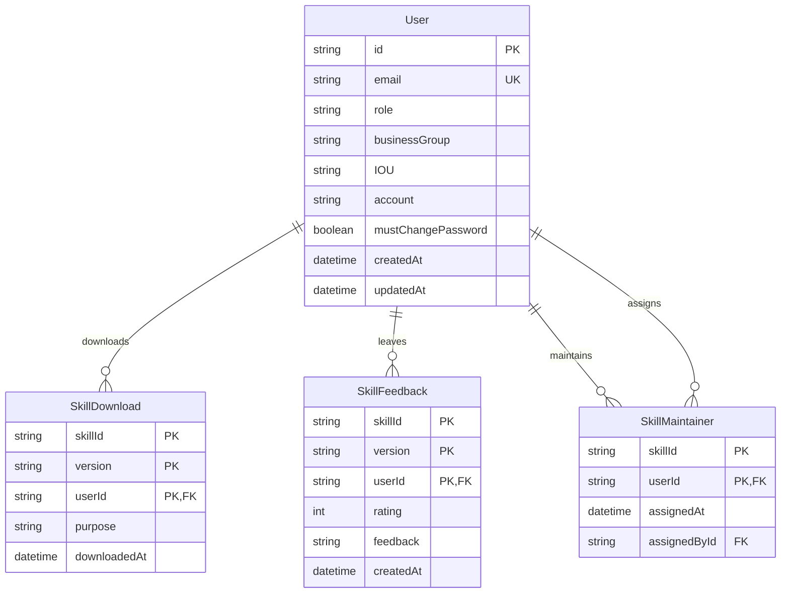
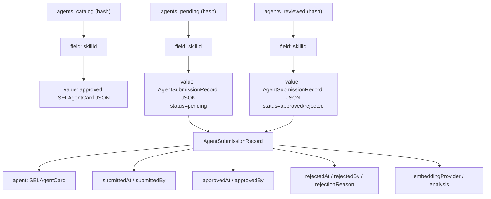

# Data Model Diagrams

This document shows the current persistence layout for both Prisma/PostgreSQL and Redis.

## Prisma ER Diagram

## Redis Structure Diagram

## Notes

- PostgreSQL is the source of truth for users, downloads, feedback, and maintainer assignments.
- Redis is the source of truth for approved skills, pending review submissions, and reviewed history.
- Approved skills are stored in `agents_catalog` only after the review workflow completes.
